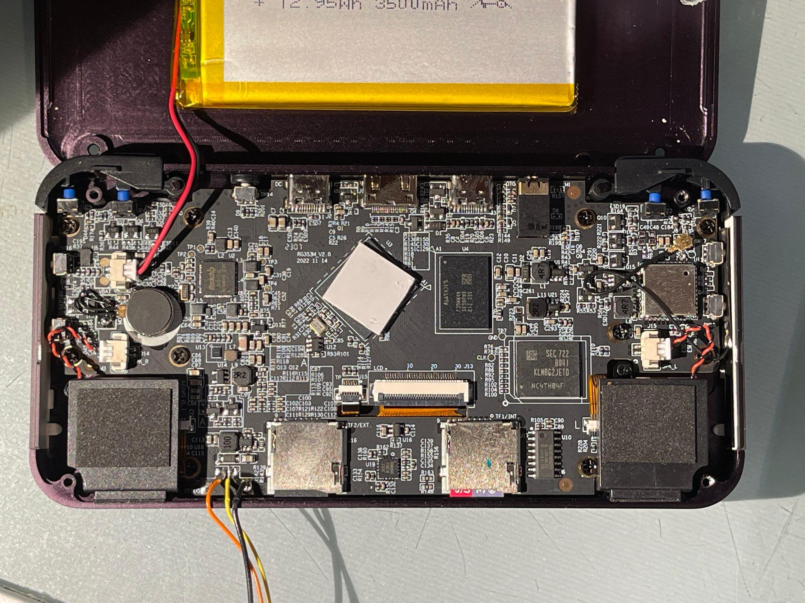
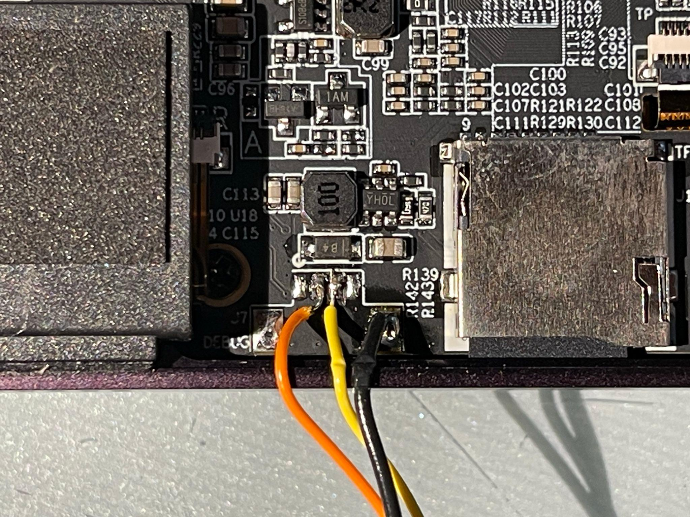

# JEBRISH (Just Enough Build Root -ish)


This is a fork of the [BuildRoot](https://buildroot.org/) project with some settings / config for RK3566-based handheld gaming devices.

It uses the U-Boot and Kernel Config developed for [JELOS](https://jelos.org/), the incredible handheld retrogaming OS.

The purpose of this fork is to provide a dead simple way to build a minimal Linux system for future RK3566-based devices that might want to run JELOS.  This can be a testbed for experimentation on things like like U-Boot, Device Tree, and the Kernel.

It attempts to address the situation that applies to a developer who wishes to help with the lower-level parts of the OS, but who is not intimately familiar with Linux or Jelos.  Jumping into the middle of the JELOS development environment can be *a lot*.  

BuildRoot provides a compact and well understood environment in which to do this work. Developers may already be familiar with it, and may be interested to learn if not. Very importantly, both build and boot times are short making for quick turnaround.  There are many online resources to explain BuildRoot.

But of course one can also work with JELOS directly!

Many variations are provided, with varying degrees of functionality.  The most minimal configuration is `jebrish_rg353x_minimal_defconfig` which is just enough to boot and log in.  The most functional is `jebrish_rg353x_minwifi_defconfig` which adds wifi and DHCP. 

# Branches

**main** - this is the main Jebrish branch.  All the configurations are here.

**master** - this is the source BuildRoot branch.  It doesn't boot on the target devices.

Various other branches may appear from time to time as experiments are done.

# Configurations

BuildRoot configurations are of the form `[company]_[device]_deconfig`.  For the purposes here, each configuration will have an additional field describing additional features of note - `jebrish_[device]_[feature]_deconfig`.  Consistent with this, the actual "baord"-specific files will appear in `board/jebrish/device_feature` with reference to common files in `board/jebrish/common` and `board/jebrish/[device]_common`.

**jebrish_rg353x_minwifi_defconfig** - minimal wifi system. Builds on the `minfs` variation.  Adds `wpa_supplicant`, `dhcpd`, etc to the build.  With a tiny bit of external config, the system will connect to network on boot.  The network details can be set by editing `/etc/wpa_supplicant.conf`.  `DropBear` is added to provide an ssh server and mDNS so the device can be found by name on the network.

**jebrish_rg353x_minfs_defconfig** - minimal configuration extended with a large sd-based non-volatile filesystem.  Expands the `rootfs` to the full size of the media on first use.  Uses `switch_root` in /init.  The filesystem is `ext4` and is mounted read-write.  You can also modify it on a host machine.

**jebrish_rg353x_minimal_defconfig** - minimal configuration for RK3566-based handhelds like the Anbernic RG353/p/v/m. It supplies enough to boot and log in.  However since this is a minimal configuration, you'll need some extra hardware to make it useful.  Either you'll need to solder in a USB-UART in the case of UART console, or you'll need a USB keyboard in the case of Display/HDMI console.

# Building

Build Prerequisites are set out in the BuildRoot [manual](https://buildroot.org/downloads/manual/manual.html#requirement)

On a machine set up to build BuildRoot, select a config, and run a command like this:

```
make jebrish_rg353x_minimal_defconfig
make
```

Compilation on a reasonable machine with a reasonable internet connection should take about 30 minutes.

It may stop for various reasons - there may be a missing host tool, or perhaps a package didn't download correctly.  Check the output.  Mostly the culprit will be readily identifiable.

At the end of the process you should have a file `output/images/sdcard.img` which you can write to an SD card and boot on your device.

```
sudo dd if=output/images/sdcard.img of=/dev/sdc bs=4MB ; sync
```

# Console

Depending on your kernel arguments (in the boot partion `/extlinux/extlinux.conf`), console appears over the UART (at 1,500,00 bps!) or on the LCD display / HDMI.  Whichever appears last on the line is the one the console runs on.  Obviously if you select the main display, you'll need a USB keyboard or similar.  Many work, and a small wireless keyboard is quite nice.

This is the default: console runs on the display.  `console=tty0` is the second `console` hence the default for the shell.

```
LABEL default
  KERNEL /%LINUXIMAGE%
  FDTDIR /
  append root=PARTUUID=%PARTUUID% rootwait console=ttyS2,1500000 console=tty0 rootfstype=ext4 panic=10 loglevel=8
```

The alternative is that the console runs over the UART.  For this option you'll need to solder wires to connect a USB-UART.  Then you'll need to connect at 1,500,000 baud.    `console=ttyS2,1500000` is the second `console` hence the default for the shell.  See the [UART](#uart) section below for more information.

```
LABEL default
  KERNEL /%LINUXIMAGE%
  FDTDIR /
  append root=PARTUUID=%PARTUUID% rootwait console=tty0 console=ttyS2,1500000 rootfstype=ext4 panic=10 loglevel=8
```

You can change this file on the SD card, or in the source before you build (`board/jebrish/...`)

# Running

With the sd card in the first slot, power on.

Almost instantaneously, U-Boot SPL will run, then U-Boot proper.  If you're on the UART, you'll be given a brief moment to interupt the boot and type commands to U-Boot.  If you do nothing, the boot will continue.

After another very short period (2s or so), the kernel will run a console - either on the display or over the UART.

You should see kernel boot debug messages on the Display.  An example appears [below](#boot-log).

Log in with username `root` and password `1234`

It's a real linux system!

```
# ls /
bin      init     linuxrc  opt      run      tmp
dev      lib      media    proc     sbin     usr
etc      lib64    mnt      root     sys      var
```

The messages on the display ought to convince you that the display is running.

Running evtest will let you see messages from all the input systems like the push buttons, analog sticks and touchscreen.

```
# evtest
No device specified, trying to scan all of /dev/input/event*
Available devices:
/dev/input/event0:      pwm-vibrator
/dev/input/event1:      rk805 pwrkey
/dev/input/event2:      Hynitron cst3xx Touchscreen
/dev/input/event3:      dw_hdmi
/dev/input/event4:      Logitech K600 TV
/dev/input/event5:      adc-keys
/dev/input/event6:      rk817_ext Headphones
/dev/input/event7:      adc-joystick
/dev/input/event8:      gpio-keys-control
/dev/input/event9:      gpio-keys-vol
Select the device event number [0-9]: 2
Input driver version is 1.0.1
Input device ID: bus 0x18 vendor 0x0 product 0x0 version 0x0
Input device name: "Hynitron cst3xx Touchscreen"
Supported events:
  Event type 0 (EV_SYN)
  Event type 1 (EV_KEY)
    Event code 330 (BTN_TOUCH)
  Event type 3 (EV_ABS)
```

# Actual Work

This site is a fork of BuildRoot.  It's almost entirely BuildRoot.  The only changes are in the `board/jebrish` directory, and the corresponding `configs/jebrish_[device]_[variation]_defconfig` files.

In the board directories you'll find

- `linux.config` - the JELOS mainline RK3566 kernel
- `uboot.config` - a U-Boot config for the Anbernic RK3566 devices
- `post-build.sh` - a script mainly to create the contents of the boot partition
- `post-image.sh` - a script that runs `genimage` to create the sdcard.img file
- `extlinux.conf` - the extlinux config file for the boot partition (including kernel arguments)
- `genimage.cfg` - the layout of the sdcard.img file
- `rootfs-overlay` - a directory of files to be copied over the rootfs
- `uboot` - U-Boot patches
- `patches` - General patches
- `rgxx3-rk3566.c` - (unused) a version of the device specific uboot code that has a lot of debug output

These files are grouped by config variation since different variations have different needs.

`jebrish_rk3566_[variatios]_defconfig` are the config files. 

# Tested Devices

**Anbernic RK353M**
- jebrish_rg353x_minimal_defconfig **OK**
- jebrish_rg353x_minfs_defconfig **OK**

# Further Work

No doubt there are many things that could be done to improve this work.  Perhaps there are errors, or perhaps the system could be more efficient.

Other devices

- confirm the other devices in the family work

Make a clear statement about the need to remove the built-in SPL on any eMMC's present.

Documentation improvements

- enumerate the most likely build requirements for BuildRoot.

Possible future new variations:

**min-display** - minimal configuration with Weston-based display

BuildRoot updates and bug fixes should be brought into this fork as they appear and can be tested.

# BuildRoot Commands

make jebrish_[device]_[variation]_defconfig

make

make menuconfig

make savedefconfig  

make show-targets 

make [target]-menuconfig

make [target]-reconfigure

make [target]-rebuild

make [target]-dirclean

# Boot Log

This is a sample boot log.

```
DDR V1.18 f366f69a7d typ 23/07/17-15:48:58
ln
LP4/4x derate en, other dram:1x trefi
ddrconfig:0
LPDDR4X, 324MHz
BW=32 Col=10 Bk=8 CS0 Row=16 CS=1 Die BW=16 Size=2048MB
tdqss: cs0 dqs0: -24ps, dqs1: -120ps, dqs2: -96ps, dqs3: -192ps, 

change to: 324MHz
clk skew:0x64

change to: 528MHz
clk skew:0x58

change to: 780MHz
clk skew:0x58

change to: 1056MHz(final freq)
PHY drv:clk:36,ca:36,DQ:29,odt:60
vrefinner:16%, vrefout:22%
dram drv:40,odt:80
vref_ca:00000071
clk skew:0x49
cs 0:
the read training result:
DQS0:0x3b, DQS1:0x3a, DQS2:0x42, DQS3:0x3b, 
min  : 0xe  0xf 0x11  0xd  0x1  0x4  0x5  0x2 , 0x8  0x7  0x2  0x1  0x9  0x5  0xb  0x5 ,
      0x11  0xf 0x10  0xd  0x5  0x2  0x5  0x7 , 0xe  0x6  0x9  0x1  0xd  0xb  0xd  0xd ,
mid  :0x2a 0x2b 0x2c 0x29 0x1e 0x20 0x22 0x20 ,0x25 0x25 0x20 0x1f 0x26 0x23 0x28 0x23 ,
      0x30 0x2f 0x2e 0x2b 0x24 0x20 0x24 0x25 ,0x2c 0x26 0x27 0x21 0x2b 0x2a 0x2b 0x2b ,
max  :0x46 0x47 0x48 0x46 0x3c 0x3d 0x40 0x3e ,0x43 0x44 0x3e 0x3e 0x44 0x41 0x45 0x42 ,
      0x4f 0x4f 0x4c 0x49 0x43 0x3f 0x43 0x43 ,0x4b 0x47 0x46 0x41 0x49 0x4a 0x49 0x4a ,
range:0x38 0x38 0x37 0x39 0x3b 0x39 0x3b 0x3c ,0x3b 0x3d 0x3c 0x3d 0x3b 0x3c 0x3a 0x3d ,
      0x3e 0x40 0x3c 0x3c 0x3e 0x3d 0x3e 0x3c ,0x3d 0x41 0x3d 0x40 0x3c 0x3f 0x3c 0x3d ,
the write training result:
DQS0:0x46, DQS1:0x39, DQS2:0x3d, DQS3:0x30, 
min  :0x61 0x63 0x66 0x63 0x57 0x57 0x5b 0x5d 0x5b ,0x52 0x51 0x4f 0x4e 0x54 0x54 0x56 0x56 0x51 ,
      0x5a 0x5a 0x56 0x56 0x4f 0x4b 0x4e 0x54 0x52 ,0x4d 0x4b 0x4a 0x48 0x51 0x50 0x4d 0x51 0x4a ,
mid  :0x7d 0x7f 0x82 0x7e 0x72 0x73 0x77 0x77 0x76 ,0x6e 0x6c 0x69 0x68 0x6f 0x6e 0x70 0x6f 0x6b ,
      0x76 0x76 0x71 0x71 0x6b 0x64 0x69 0x6d 0x6d ,0x69 0x67 0x66 0x62 0x6c 0x6c 0x68 0x6d 0x66 ,
max  :0x9a 0x9b 0x9e 0x9a 0x8e 0x90 0x94 0x92 0x91 ,0x8a 0x88 0x84 0x83 0x8b 0x88 0x8a 0x89 0x85 ,
      0x93 0x92 0x8d 0x8d 0x87 0x7d 0x84 0x87 0x88 ,0x86 0x83 0x82 0x7d 0x88 0x88 0x84 0x8a 0x82 ,
range:0x39 0x38 0x38 0x37 0x37 0x39 0x39 0x35 0x36 ,0x38 0x37 0x35 0x35 0x37 0x34 0x34 0x33 0x34 ,
      0x39 0x38 0x37 0x37 0x38 0x32 0x36 0x33 0x36 ,0x39 0x38 0x38 0x35 0x37 0x38 0x37 0x39 0x38 ,
CA Training result:
cs:0 min  :0x46 0x45 0x40 0x3a 0x41 0x3a 0x40 ,0x47 0x41 0x40 0x39 0x41 0x39 0x44 ,
cs:0 mid  :0x84 0x86 0x7c 0x7b 0x7c 0x7b 0x6d ,0x83 0x83 0x7d 0x7b 0x7c 0x7b 0x6f ,
cs:0 max  :0xc2 0xc8 0xb8 0xbd 0xb7 0xbc 0x9b ,0xbf 0xc5 0xba 0xbe 0xb8 0xbd 0x9b ,
cs:0 range:0x7c 0x83 0x78 0x83 0x76 0x82 0x5b ,0x78 0x84 0x7a 0x85 0x77 0x84 0x57 ,
out

U-Boot SPL 2024.01-rc1 (Nov 13 2023 - 17:35:45 -0800)
Trying to boot from MMC1
INFO:    Preloader serial: 2
NOTICE:  BL31: v2.3():v2.3-607-gbf602aff1:cl
NOTICE:  BL31: Built : 10:16:03, Jun  5 2023
INFO:    GICv3 without legacy support detected.
INFO:    ARM GICv3 driver initialized in EL3
INFO:    pmu v1 is valid 220114
INFO:    dfs DDR fsp_param[0].freq_mhz= 1056MHz
INFO:    dfs DDR fsp_param[1].freq_mhz= 324MHz
INFO:    dfs DDR fsp_param[2].freq_mhz= 528MHz
INFO:    dfs DDR fsp_param[3].freq_mhz= 780MHz
INFO:    Using opteed sec cpu_context!
INFO:    boot cpu mask: 0
INFO:    BL31: Initializing runtime services
WARNING: No OPTEE provided by BL2 boot loader, Booting device without OPTEE initialization. SMC`s destined for OPTEE will return SMC_UNK
ERROR:   Error initializing runtime service opteed_fast
INFO:    BL31: Preparing for EL3 exit to normal world
INFO:    Entry point address = 0xa00000
INFO:    SPSR = 0x3c9


U-Boot 2024.01-rc1 (Nov 13 2023 - 17:35:45 -0800)

Model: RGXX3
DRAM:  2 GiB
PMIC:  RK8170 (on=0x80, off=0x00)
Core:  595 devices, 29 uclasses, devicetree: separate
MMC:   mmc@fe000000: 2, mmc@fe2b0000: 1, mmc@fe2c0000: 3, mmc@fe310000: 0
Loading Environment from nowhere... OK
In:    serial@fe660000
Out:   serial@fe660000
Err:   serial@fe660000
Model: RGXX3
Hit any key to stop autoboot:  0 
** Booting bootflow 'mmc@fe2b0000.bootdev.part_1' with extlinux
1:      default
Retrieving file: /Image
append: root=PARTUUID=02cdfea8-8f82-49d3-ab62-4ee4f6c9131a rootwait console=ttyS2,1500000 console=tty0 rootfstype=ext4 panic=10 loglevel=8 panic=20
Retrieving file: /rockchip/rk3566-anbernic-rg353p.dtb
Moving Image from 0x2080000 to 0x2200000, end=43a0000
## Flattened Device Tree blob at 0a100000
   Booting using the fdt blob at 0xa100000
Working FDT set to a100000
   Loading Device Tree to 000000007def0000, end 000000007df0fbef ... OK
Working FDT set to 7def0000

Starting kernel ...

[    0.000000] Booting Linux on physical CPU 0x0000000000 [0x412fd050]
[    0.000000] Linux version 6.6.0 (david@DW-ASUS) (aarch64-buildroot-linux-gnu-gcc.br_real (Buildroot -gbce3276f04) 12.3.0, GNU ld (GNU Binutils) 2.40) #2 SMP PREEMPT Mon Nov 13 17:49:22 PST 2023
[    0.000000] KASLR disabled due to lack of seed
[    0.000000] Machine model: RG353M
[    0.000000] Zone ranges:
[    0.000000]   DMA      [mem 0x0000000000200000-0x000000007fffffff]
[    0.000000]   DMA32    empty
[    0.000000]   Normal   empty
[    0.000000] Movable zone start for each node
[    0.000000] Early memory node ranges
[    0.000000]   node   0: [mem 0x0000000000200000-0x000000007fffffff]
[    0.000000] Initmem setup node 0 [mem 0x0000000000200000-0x000000007fffffff]
[    0.000000] On node 0, zone DMA: 512 pages in unavailable ranges
[    0.000000] psci: probing for conduit method from DT.
[    0.000000] psci: PSCIv1.1 detected in firmware.
[    0.000000] psci: Using standard PSCI v0.2 function IDs
[    0.000000] psci: MIGRATE_INFO_TYPE not supported.
[    0.000000] psci: SMC Calling Convention v1.2
[    0.000000] percpu: Embedded 20 pages/cpu s41784 r8192 d31944 u81920
[    0.000000] pcpu-alloc: s41784 r8192 d31944 u81920 alloc=20*4096
[    0.000000] pcpu-alloc: [0] 0 [0] 1 [0] 2 [0] 3 
[    0.000000] Detected VIPT I-cache on CPU0
[    0.000000] CPU features: detected: GIC system register CPU interface
[    0.000000] CPU features: detected: Virtualization Host Extensions
[    0.000000] CPU features: detected: Qualcomm erratum 1009, or ARM erratum 1286807, 2441009
[    0.000000] CPU features: detected: ARM errata 1165522, 1319367, or 1530923
[    0.000000] alternatives: applying boot alternatives
[    0.000000] Kernel command line: root=PARTUUID=02cdfea8-8f82-49d3-ab62-4ee4f6c9131a rootwait console=ttyS2,1500000 console=tty0 rootfstype=ext4 panic=10 loglevel=8 panic=20
[    0.000000] Dentry cache hash table entries: 262144 (order: 9, 2097152 bytes, linear)
[    0.000000] Inode-cache hash table entries: 131072 (order: 8, 1048576 bytes, linear)
[    0.000000] Built 1 zonelists, mobility grouping on.  Total pages: 515592
[    0.000000] mem auto-init: stack:off, heap alloc:on, heap free:on
[    0.000000] mem auto-init: clearing system memory may take some time...
[    0.000000] software IO TLB: area num 4.
[    0.000000] software IO TLB: mapped [mem 0x0000000077e00000-0x000000007be00000] (64MB)
[    0.000000] Memory: 1953368K/2095104K available (12480K kernel code, 2024K rwdata, 5504K rodata, 13504K init, 733K bss, 141736K reserved, 0K cma-reserved)
[    0.000000] SLUB: HWalign=64, Order=0-3, MinObjects=0, CPUs=4, Nodes=1
[    0.000000] rcu: Preemptible hierarchical RCU implementation.
[    0.000000]  Trampoline variant of Tasks RCU enabled.
[    0.000000]  Tracing variant of Tasks RCU enabled.
[    0.000000] rcu: RCU calculated value of scheduler-enlistment delay is 25 jiffies.
[    0.000000] NR_IRQS: 64, nr_irqs: 64, preallocated irqs: 0
[    0.000000] GICv3: GIC: Using split EOI/Deactivate mode
[    0.000000] GICv3: 320 SPIs implemented
[    0.000000] GICv3: 0 Extended SPIs implemented
[    0.000000] GICv3: MBI range [296:319]
[    0.000000] GICv3: Using MBI frame 0x00000000fd410000
[    0.000000] Root IRQ handler: gic_handle_irq
[    0.000000] GICv3: GICv3 features: 16 PPIs
[    0.000000] GICv3: CPU0: found redistributor 0 region 0:0x00000000fd460000
[    0.000000] ITS: No ITS available, not enabling LPIs
[    0.000000] rcu: srcu_init: Setting srcu_struct sizes based on contention.
[    0.000000] arch_timer: cp15 timer(s) running at 24.00MHz (phys).
[    0.000000] clocksource: arch_sys_counter: mask: 0xffffffffffffff max_cycles: 0x588fe9dc0, max_idle_ns: 440795202592 ns
[    0.000001] sched_clock: 56 bits at 24MHz, resolution 41ns, wraps every 4398046511097ns
[    0.001623] Console: colour dummy device 80x25
[    0.001645] printk: console [tty0] enabled
[    0.002523] Calibrating delay loop (skipped), value calculated using timer frequency.. 48.00 BogoMIPS (lpj=96000)
[    0.002569] pid_max: default: 32768 minimum: 301
[    0.002723] LSM: initializing lsm=capability,integrity
[    0.002910] Mount-cache hash table entries: 4096 (order: 3, 32768 bytes, linear)
[    0.002956] Mountpoint-cache hash table entries: 4096 (order: 3, 32768 bytes, linear)
[    0.004533] cacheinfo: Unable to detect cache hierarchy for CPU 0
[    0.006342] RCU Tasks: Setting shift to 2 and lim to 1 rcu_task_cb_adjust=1.
[    0.006540] RCU Tasks Trace: Setting shift to 2 and lim to 1 rcu_task_cb_adjust=1.
[    0.007006] rcu: Hierarchical SRCU implementation.
[    0.007036] rcu:     Max phase no-delay instances is 1000.
[    0.009868] smp: Bringing up secondary CPUs ...
[    0.010989] Detected VIPT I-cache on CPU1
[    0.011095] GICv3: CPU1: found redistributor 100 region 0:0x00000000fd480000
[    0.011163] CPU1: Booted secondary processor 0x0000000100 [0x412fd050]
[    0.012515] Detected VIPT I-cache on CPU2
[    0.012602] GICv3: CPU2: found redistributor 200 region 0:0x00000000fd4a0000
[    0.012650] CPU2: Booted secondary processor 0x0000000200 [0x412fd050]
[    0.013785] Detected VIPT I-cache on CPU3
[    0.013871] GICv3: CPU3: found redistributor 300 region 0:0x00000000fd4c0000
[    0.013918] CPU3: Booted secondary processor 0x0000000300 [0x412fd050]
[    0.014106] smp: Brought up 1 node, 4 CPUs
[    0.014286] SMP: Total of 4 processors activated.
[    0.014310] CPU features: detected: 32-bit EL0 Support
[    0.014331] CPU features: detected: Data cache clean to the PoU not required for I/D coherence
[    0.014361] CPU features: detected: Common not Private translations
[    0.014383] CPU features: detected: CRC32 instructions
[    0.014405] CPU features: detected: Data cache clean to Point of Persistence
[    0.014433] CPU features: detected: RCpc load-acquire (LDAPR)
[    0.014454] CPU features: detected: LSE atomic instructions
[    0.014477] CPU features: detected: Privileged Access Never
[    0.014497] CPU features: detected: RAS Extension Support
[    0.014522] CPU features: detected: Speculative Store Bypassing Safe (SSBS)
[    0.014667] CPU: All CPU(s) started at EL2
[    0.014696] alternatives: applying system-wide alternatives
[    0.018551] devtmpfs: initialized
[    0.048006] clocksource: jiffies: mask: 0xffffffff max_cycles: 0xffffffff, max_idle_ns: 7645041785100000 ns
[    0.048087] futex hash table entries: 1024 (order: 4, 65536 bytes, linear)
[    0.048459] pinctrl core: initialized pinctrl subsystem
[    0.049417] regulator-dummy: no parameters, enabled
[    0.050359] NET: Registered PF_NETLINK/PF_ROUTE protocol family
[    0.051466] DMA: preallocated 256 KiB GFP_KERNEL pool for atomic allocations
[    0.051576] DMA: preallocated 256 KiB GFP_KERNEL|GFP_DMA pool for atomic allocations
[    0.051676] DMA: preallocated 256 KiB GFP_KERNEL|GFP_DMA32 pool for atomic allocations
[    0.053143] thermal_sys: Registered thermal governor 'fair_share'
[    0.053156] thermal_sys: Registered thermal governor 'step_wise'
[    0.053186] thermal_sys: Registered thermal governor 'power_allocator'
[    0.053316] cpuidle: using governor ladder
[    0.053444] cpuidle: using governor menu
[    0.053810] hw-breakpoint: found 6 breakpoint and 4 watchpoint registers.
[    0.054059] ASID allocator initialised with 65536 entries
[    0.054366] Serial: AMBA PL011 UART driver
[    0.072797] platform fe060000.dsi: Fixed dependency cycle(s) with /dsi@fe060000/panel@0/port/endpoint
[    0.072897] platform fe060000.dsi: Fixed dependency cycle(s) with /vop@fe040000/ports/port@1/endpoint@4
[    0.073734] platform fe0a0000.hdmi: Fixed dependency cycle(s) with /vop@fe040000/ports/port@0/endpoint@2
[    0.110072] gpio gpiochip0: Static allocation of GPIO base is deprecated, use dynamic allocation.
[    0.110695] rockchip-gpio fdd60000.gpio: probed /pinctrl/gpio@fdd60000
[    0.111329] gpio gpiochip1: Static allocation of GPIO base is deprecated, use dynamic allocation.
[    0.111796] rockchip-gpio fe740000.gpio: probed /pinctrl/gpio@fe740000
[    0.112471] gpio gpiochip2: Static allocation of GPIO base is deprecated, use dynamic allocation.
[    0.112920] rockchip-gpio fe750000.gpio: probed /pinctrl/gpio@fe750000
[    0.113502] gpio gpiochip3: Static allocation of GPIO base is deprecated, use dynamic allocation.
[    0.114008] rockchip-gpio fe760000.gpio: probed /pinctrl/gpio@fe760000
[    0.114871] gpio gpiochip4: Static allocation of GPIO base is deprecated, use dynamic allocation.
[    0.115315] rockchip-gpio fe770000.gpio: probed /pinctrl/gpio@fe770000
[    0.121677] platform hdmi-con: Fixed dependency cycle(s) with /hdmi@fe0a0000/ports/port@1/endpoint
[    0.127327] Modules: 24160 pages in range for non-PLT usage
[    0.127348] Modules: 515680 pages in range for PLT usage
[    0.129346] cryptd: max_cpu_qlen set to 1000
[    0.198167] raid6: neonx8   gen()  1455 MB/s
[    0.266410] raid6: neonx4   gen()  1415 MB/s
[    0.334625] raid6: neonx2   gen()  1290 MB/s
[    0.402851] raid6: neonx1   gen()  1054 MB/s
[    0.471084] raid6: int64x8  gen()   447 MB/s
[    0.539308] raid6: int64x4  gen()   723 MB/s
[    0.607525] raid6: int64x2  gen()   915 MB/s
[    0.675765] raid6: int64x1  gen()   649 MB/s
[    0.675796] raid6: using algorithm neonx8 gen() 1455 MB/s
[    0.743926] raid6: .... xor() 1089 MB/s, rmw enabled
[    0.743957] raid6: using neon recovery algorithm
[    0.745060] vcc_sys: 3800 mV, enabled
[    0.745339] reg-fixed-voltage regulator-vcc-sys: vcc_sys supplying 3800000uV
[    0.745609] vcc_wifi: 3300 mV, enabled
[    0.745674] iommu: Default domain type: Translated
[    0.745709] iommu: DMA domain TLB invalidation policy: strict mode
[    0.745910] reg-fixed-voltage regulator-vcc-wifi: vcc_wifi supplying 3300000uV
[    0.746346] SCSI subsystem initialized
[    0.746678] libata version 3.00 loaded.
[    0.747008] usbcore: registered new interface driver usbfs
[    0.747093] usbcore: registered new interface driver hub
[    0.747191] usbcore: registered new device driver usb
[    0.748275] mc: Linux media interface: v0.10
[    0.748405] videodev: Linux video capture interface: v2.00
[    0.748635] pps_core: LinuxPPS API ver. 1 registered
[    0.748664] pps_core: Software ver. 5.3.6 - Copyright 2005-2007 Rodolfo Giometti <giometti@linux.it>
[    0.748723] PTP clock support registered
[    0.749908] ARM FF-A: FFA_VERSION returned not supported
[    0.750041] scmi_core: SCMI protocol bus registered
[    0.750580] Advanced Linux Sound Architecture Driver Initialized.
[    0.751781] vgaarb: loaded
[    0.752530] clocksource: Switched to clocksource arch_sys_counter
[    0.753202] FS-Cache: Loaded
[    0.770761] NET: Registered PF_INET protocol family
[    0.771007] IP idents hash table entries: 32768 (order: 6, 262144 bytes, linear)
[    0.774194] tcp_listen_portaddr_hash hash table entries: 1024 (order: 3, 32768 bytes, linear)
[    0.774374] Table-perturb hash table entries: 65536 (order: 6, 262144 bytes, linear)
[    0.774445] TCP established hash table entries: 16384 (order: 5, 131072 bytes, linear)
[    0.774625] TCP bind hash table entries: 16384 (order: 8, 1048576 bytes, linear)
[    0.775625] TCP: Hash tables configured (established 16384 bind 16384)
[    0.775809] UDP hash table entries: 1024 (order: 4, 98304 bytes, linear)
[    0.775979] UDP-Lite hash table entries: 1024 (order: 4, 98304 bytes, linear)
[    0.776377] NET: Registered PF_UNIX/PF_LOCAL protocol family
[    0.776476] PCI: CLS 0 bytes, default 64
[    0.782728] Initialise system trusted keyrings
[    0.783107] workingset: timestamp_bits=46 max_order=19 bucket_order=0
[    0.783651] squashfs: version 4.0 (2009/01/31) Phillip Lougher
[    0.784076] fuse: init (API version 7.39)
[    0.784754] SGI XFS with security attributes, no debug enabled
[    0.825668] jitterentropy: Initialization failed with host not compliant with requirements: 9
[    0.825744] NET: Registered PF_ALG protocol family
[    0.825811] xor: measuring software checksum speed
[    0.831974]    8regs           :  1616 MB/sec
[    0.837136]    32regs          :  1987 MB/sec
[    0.843422]    arm64_neon      :  1593 MB/sec
[    0.843471] xor: using function: 32regs (1987 MB/sec)
[    0.843513] async_tx: api initialized (async)
[    0.843542] Key type asymmetric registered
[    0.843564] Asymmetric key parser 'x509' registered
[    0.843721] Block layer SCSI generic (bsg) driver version 0.4 loaded (major 244)
[    0.843770] io scheduler mq-deadline registered
[    0.847004] phy phy-fe850000.mipi-dphy.0: Looking up phy-supply from device tree
[    0.847069] phy phy-fe850000.mipi-dphy.0: Looking up phy-supply property in node /mipi-dphy@fe850000 failed
[    0.849914] phy phy-fe8a0000.usb2phy.1: Looking up phy-supply from device tree
[    0.849979] phy phy-fe8a0000.usb2phy.1: Looking up phy-supply property in node /usb2phy@fe8a0000/otg-port failed
[    0.852283] phy phy-fe8b0000.usb2phy.2: Looking up phy-supply from device tree
[    0.852348] phy phy-fe8b0000.usb2phy.2: Looking up phy-supply property in node /usb2phy@fe8b0000/host-port failed
[    0.854518] phy phy-fe830000.phy.3: Looking up phy-supply from device tree
[    0.854579] phy phy-fe830000.phy.3: Looking up phy-supply property in node /phy@fe830000 failed
[    0.861174] pwm-backlight backlight: Looking up power-supply from device tree
[    0.868230] dma-pl330 fe530000.dma-controller: Loaded driver for PL330 DMAC-241330
[    0.868298] dma-pl330 fe530000.dma-controller:       DBUFF-128x8bytes Num_Chans-8 Num_Peri-32 Num_Events-16
[    0.872238] dma-pl330 fe550000.dma-controller: Loaded driver for PL330 DMAC-241330
[    0.872304] dma-pl330 fe550000.dma-controller:       DBUFF-128x8bytes Num_Chans-8 Num_Peri-32 Num_Events-16
[    0.875417] Serial: 8250/16550 driver, 5 ports, IRQ sharing enabled
[    0.881790] fe650000.serial: ttyS1 at MMIO 0xfe650000 (irq = 25, base_baud = 1500000) is a 16550A
[    0.882224] serial serial0: tty port ttyS1 registered
[    0.884454] fe660000.serial: ttyS2 at MMIO 0xfe660000 (irq = 26, base_baud = 1500000) is a 16550A
[    0.884833] printk: console [ttyS2] enabled
[    1.001873] rockchip-vop2 fe040000.vop: Adding to iommu group 2
[    1.005511] phy phy-fe060000.dsi.4: Looking up phy-supply from device tree
[    1.006194] phy phy-fe060000.dsi.4: Looking up phy-supply property in node /dsi@fe060000 failed
[    1.007637] mipi-dsi fe060000.dsi.0: Fixed dependency cycle(s) with /dsi@fe060000/ports/port@1/endpoint
[    1.017581] brd: module loaded
[    1.027524] loop: module loaded
[    1.028687] zram: Added device: zram0
[    1.032330] wireguard: WireGuard 1.0.0 loaded. See www.wireguard.com for information.
[    1.033119] wireguard: Copyright (C) 2015-2019 Jason A. Donenfeld <Jason@zx2c4.com>. All Rights Reserved.
[    1.034994] CAN device driver interface
[    1.035433] sja1000 CAN netdevice driver
[    1.035807] e100: Intel(R) PRO/100 Network Driver
[    1.036242] e100: Copyright(c) 1999-2006 Intel Corporation
[    1.036829] e1000: Intel(R) PRO/1000 Network Driver
[    1.037287] e1000: Copyright (c) 1999-2006 Intel Corporation.
[    1.037864] e1000e: Intel(R) PRO/1000 Network Driver
[    1.038326] e1000e: Copyright(c) 1999 - 2015 Intel Corporation.
[    1.038916] igb: Intel(R) Gigabit Ethernet Network Driver
[    1.039416] igb: Copyright (c) 2007-2014 Intel Corporation.
[    1.039978] ixgbe: Intel(R) 10 Gigabit PCI Express Network Driver
[    1.040565] ixgbe: Copyright (c) 1999-2016 Intel Corporation.
[    1.043228] usbcore: registered new interface driver rtl8150
[    1.043827] usbcore: registered new device driver r8152-cfgselector
[    1.044460] usbcore: registered new interface driver r8152
[    1.045095] usbcore: registered new interface driver asix
[    1.045652] usbcore: registered new interface driver ax88179_178a
[    1.046279] usbcore: registered new interface driver cdc_ether
[    1.046868] usbcore: registered new interface driver rndis_host
[    1.047488] usbcore: registered new interface driver cdc_ncm
[    1.048066] usbcore: registered new interface driver qmi_wwan
[    1.048711] usbcore: registered new interface driver cdc_mbim
[    1.049301] usbcore: registered new interface driver r8153_ecm
[    1.122753] ehci-platform fd880000.usb: EHCI Host Controller
[    1.123381] ohci-platform fd8c0000.usb: Generic Platform OHCI controller
[    1.123626] xhci-hcd xhci-hcd.0.auto: xHCI Host Controller
[    1.123739] ehci-platform fd880000.usb: new USB bus registered, assigned bus number 1
[    1.123940] ehci-platform fd880000.usb: irq 32, io mem 0xfd880000
[    1.124351] ohci-platform fd8c0000.usb: new USB bus registered, assigned bus number 2
[    1.124889] xhci-hcd xhci-hcd.0.auto: new USB bus registered, assigned bus number 3
[    1.125462] ohci-platform fd8c0000.usb: irq 33, io mem 0xfd8c0000
[    1.126007] xhci-hcd xhci-hcd.0.auto: hcc params 0x0220fe64 hci version 0x110 quirks 0x0000000002000010
[    1.128747] xhci-hcd xhci-hcd.0.auto: irq 31, io mem 0xfd000000
[    1.129575] xhci-hcd xhci-hcd.0.auto: xHCI Host Controller
[    1.130492] xhci-hcd xhci-hcd.0.auto: new USB bus registered, assigned bus number 4
[    1.131232] xhci-hcd xhci-hcd.0.auto: Host supports USB 3.0 SuperSpeed
[    1.132221] usb usb3: New USB device found, idVendor=1d6b, idProduct=0002, bcdDevice= 6.06
[    1.133024] usb usb3: New USB device strings: Mfr=3, Product=2, SerialNumber=1
[    1.133694] usb usb3: Product: xHCI Host Controller
[    1.134150] usb usb3: Manufacturer: Linux 6.6.0 xhci-hcd
[    1.134641] usb usb3: SerialNumber: xhci-hcd.0.auto
[    1.136089] hub 3-0:1.0: USB hub found
[    1.136556] hub 3-0:1.0: 1 port detected
[    1.137658] usb usb4: We don't know the algorithms for LPM for this host, disabling LPM.
[    1.138661] usb usb4: New USB device found, idVendor=1d6b, idProduct=0003, bcdDevice= 6.06
[    1.139429] usb usb4: New USB device strings: Mfr=3, Product=2, SerialNumber=1
[    1.140094] usb usb4: Product: xHCI Host Controller
[    1.140576] usb usb4: Manufacturer: Linux 6.6.0 xhci-hcd
[    1.140605] ehci-platform fd880000.usb: USB 2.0 started, EHCI 1.00
[    1.141073] usb usb4: SerialNumber: xhci-hcd.0.auto
[    1.143113] hub 4-0:1.0: USB hub found
[    1.143542] hub 4-0:1.0: 1 port detected
[    1.144793] usbcore: registered new interface driver cdc_acm
[    1.145160] usb usb1: New USB device found, idVendor=1d6b, idProduct=0002, bcdDevice= 6.06
[    1.145328] cdc_acm: USB Abstract Control Model driver for USB modems and ISDN adapters
[    1.145360] usb usb1: New USB device strings: Mfr=3, Product=2, SerialNumber=1
[    1.145453] usbcore: registered new interface driver cdc_wdm
[    1.146128] usb usb1: Product: EHCI Host Controller
[    1.146555] usbcore: registered new interface driver uas
[    1.146865] usb usb1: Manufacturer: Linux 6.6.0 ehci_hcd
[    1.146976] usbcore: registered new interface driver usb-storage
[    1.147537] usb usb1: SerialNumber: fd880000.usb
[    1.147606] usbcore: registered new interface driver ums-alauda
[    1.149074] hub 1-0:1.0: USB hub found
[    1.149568] usbcore: registered new interface driver ums-cypress
[    1.150122] hub 1-0:1.0: 1 port detected
[    1.150545] usbcore: registered new interface driver ums-datafab
[    1.152863] usbcore: registered new interface driver ums_eneub6250
[    1.153491] usbcore: registered new interface driver ums-freecom
[    1.154099] usbcore: registered new interface driver ums-isd200
[    1.154698] usbcore: registered new interface driver ums-jumpshot
[    1.155312] usbcore: registered new interface driver ums-karma
[    1.155902] usbcore: registered new interface driver ums-onetouch
[    1.156583] usbcore: registered new interface driver ums-realtek
[    1.157209] usbcore: registered new interface driver ums-sddr09
[    1.157812] usbcore: registered new interface driver ums-sddr55
[    1.158411] usbcore: registered new interface driver ums-usbat
[    1.159095] usbcore: registered new interface driver usbserial_generic
[    1.159749] usbserial: USB Serial support registered for generic
[    1.160364] usbcore: registered new interface driver ch341
[    1.160958] usbserial: USB Serial support registered for ch341-uart
[    1.161619] usbcore: registered new interface driver cp210x
[    1.162183] usbserial: USB Serial support registered for cp210x
[    1.162810] usbcore: registered new interface driver ftdi_sio
[    1.163389] usbserial: USB Serial support registered for FTDI USB Serial Device
[    1.164220] usbcore: registered new interface driver keyspan
[    1.164828] usbserial: USB Serial support registered for Keyspan - (without firmware)
[    1.165594] usbserial: USB Serial support registered for Keyspan 1 port adapter
[    1.166310] usbserial: USB Serial support registered for Keyspan 2 port adapter
[    1.167024] usbserial: USB Serial support registered for Keyspan 4 port adapter
[    1.167764] usbcore: registered new interface driver option
[    1.168341] usbserial: USB Serial support registered for GSM modem (1-port)
[    1.169218] usbcore: registered new interface driver oti6858
[    1.169797] usbserial: USB Serial support registered for oti6858
[    1.170413] usbcore: registered new interface driver pl2303
[    1.170976] usbserial: USB Serial support registered for pl2303
[    1.171590] usbcore: registered new interface driver qcserial
[    1.172168] usbserial: USB Serial support registered for Qualcomm USB modem
[    1.172913] usbcore: registered new interface driver sierra
[    1.173482] usbserial: USB Serial support registered for Sierra USB modem
[    1.176427] usbcore: registered new interface driver usbtouchscreen
[    1.177467] pwm-vibrator pwm-vibrator: Looking up vcc-supply from device tree
[    1.178144] pwm-vibrator pwm-vibrator: Looking up vcc-supply property in node /pwm-vibrator failed
[    1.178993] pwm-vibrator pwm-vibrator: supply vcc not found, using dummy regulator
[    1.180233] input: pwm-vibrator as /devices/platform/pwm-vibrator/input/input0
[    1.182426] i2c_dev: i2c /dev entries driver
[    1.184651] i2c 0-0020: Fixed dependency cycle(s) with /i2c@fdd40000/pmic@20/regulators/BOOST
[    1.189031] usb usb2: New USB device found, idVendor=1d6b, idProduct=0001, bcdDevice= 6.06
[    1.189826] usb usb2: New USB device strings: Mfr=3, Product=2, SerialNumber=1
[    1.190492] usb usb2: Product: Generic Platform OHCI controller
[    1.191039] usb usb2: Manufacturer: Linux 6.6.0 ohci_hcd
[    1.191531] usb usb2: SerialNumber: fd8c0000.usb
[    1.193136] hub 2-0:1.0: USB hub found
[    1.193614] hub 2-0:1.0: 1 port detected
[    1.271496] rk808-regulator rk808-regulator: there is no dvs0 gpio
[    1.272130] rk808-regulator rk808-regulator: there is no dvs1 gpio
[    1.272861] rk808-regulator rk808-regulator: Looking up vcc1-supply from device tree
[    1.273602] vdd_logic: supplied by vcc_sys
[    1.273996] vcc_sys: could not add device link regulator.3: -2
[    1.278902] vdd_logic: 500 <--> 1350 mV at 900 mV, enabled
[    1.280364] rk808-regulator rk808-regulator: Looking up vcc2-supply from device tree
[    1.281174] vdd_gpu: supplied by vcc_sys
[    1.281562] vcc_sys: could not add device link regulator.4: -2
[    1.285940] vdd_gpu: 500 <--> 1350 mV at 900 mV, enabled
[    1.287376] rk808-regulator rk808-regulator: Looking up vcc3-supply from device tree
[    1.288113] vcc_ddr: supplied by vcc_sys
[    1.288491] vcc_sys: could not add device link regulator.5: -2
[    1.291960] vcc_ddr: at 500 mV, enabled
[    1.293250] rk808-regulator rk808-regulator: Looking up vcc4-supply from device tree
[    1.293989] vcc_3v3: supplied by vcc_sys
[    1.294368] vcc_sys: could not add device link regulator.6: -2
[    1.298264] vcc_3v3: 3300 mV, enabled
[    1.299541] rk808-regulator rk808-regulator: Looking up vcc5-supply from device tree
[    1.300282] vcca1v8_pmu: supplied by vcc_sys
[    1.300740] vcc_sys: could not add device link regulator.7: -2
[    1.304682] vcca1v8_pmu: 1800 mV, enabled
[    1.305995] rk808-regulator rk808-regulator: Looking up vcc5-supply from device tree
[    1.306743] vdda_0v9: supplied by vcc_sys
[    1.307128] vcc_sys: could not add device link regulator.8: -2
[    1.310589] vdda_0v9: 900 mV, enabled
[    1.311842] rk808-regulator rk808-regulator: Looking up vcc5-supply from device tree
[    1.312626] vdda0v9_pmu: supplied by vcc_sys
[    1.313037] vcc_sys: could not add device link regulator.9: -2
[    1.317048] vdda0v9_pmu: 900 mV, enabled
[    1.318343] rk808-regulator rk808-regulator: Looking up vcc6-supply from device tree
[    1.319085] vccio_acodec: supplied by vcc_sys
[    1.319510] vcc_sys: could not add device link regulator.10: -2
[    1.322997] vccio_acodec: 3300 mV, enabled
[    1.324319] rk808-regulator rk808-regulator: Looking up vcc6-supply from device tree
[    1.325109] vccio_sd: supplied by vcc_sys
[    1.325501] vcc_sys: could not add device link regulator.11: -2
[    1.329453] vccio_sd: 1800 <--> 3300 mV at 3300 mV, enabled
[    1.330919] rk808-regulator rk808-regulator: Looking up vcc6-supply from device tree
[    1.331662] vcc3v3_pmu: supplied by vcc_sys
[    1.332063] vcc_sys: could not add device link regulator.12: -2
[    1.336077] vcc3v3_pmu: 3300 mV, enabled
[    1.337447] rk808-regulator rk808-regulator: Looking up vcc7-supply from device tree
[    1.338200] vcc_1v8: supplied by vcc_sys
[    1.338578] vcc_sys: could not add device link regulator.13: -2
[    1.342050] vcc_1v8: 1800 mV, enabled
[    1.343337] rk808-regulator rk808-regulator: Looking up vcc7-supply from device tree
[    1.344080] vcc1v8_dvp: supplied by vcc_sys
[    1.344482] vcc_sys: could not add device link regulator.14: -2
[    1.345644] vcc1v8_dvp: Bringing 600000uV into 1800000-1800000uV
[    1.351373] vcc1v8_dvp: 1800 <--> 3300 mV at 1800 mV, enabled
[    1.352894] rk808-regulator rk808-regulator: Looking up vcc7-supply from device tree
[    1.353642] vcc2v8_dvp: supplied by vcc_sys
[    1.354045] vcc_sys: could not add device link regulator.15: -2
[    1.357531] vcc2v8_dvp: 2800 mV, enabled
[    1.358853] rk808-regulator rk808-regulator: Looking up vcc8-supply from device tree
[    1.359598] boost: supplied by vcc_sys
[    1.359962] vcc_sys: could not add device link regulator.16: -2
[    1.363998] boost: 4700 <--> 5400 mV at 4700 mV, enabled
[    1.366460] otg_switch: no parameters, disabled
[    1.367127] rk808-regulator rk808-regulator: Looking up vcc9-supply from device tree
[    1.367902] otg_switch: supplied by boost
[    1.375430] input: rk805 pwrkey as /devices/platform/fdd40000.i2c/i2c-0/0-0020/rk805-pwrkey/input/input1
[    1.389038] rk808-rtc rk808-rtc: registered as rtc0
[    1.392293] rk808-rtc rk808-rtc: setting system clock to 2017-08-05T09:00:14 UTC (1501923614)
[    1.396858] fan53555-regulator 0-0040: FAN53555 Option[8] Rev[1] Detected!
[    1.397567] fan53555-regulator 0-0040: Looking up vin-supply from device tree
[    1.398255] vdd_cpu: supplied by vcc_sys
[    1.398640] vcc_sys: could not add device link regulator.18: -2
[    1.399799] vdd_cpu: override min_uV, 712500 -> 720000
[    1.400234] IR JVC protocol handler initialized
[    1.400301] vdd_cpu: override max_uV, 1390000 -> 1230000
[    1.400326] IR MCE Keyboard/mouse protocol handler initialized
[    1.401785] IR NEC protocol handler initialized
[    1.402209] IR RC5(x/sz) protocol handler initialized
[    1.402672] IR RC6 protocol handler initialized
[    1.403091] IR SANYO protocol handler initialized
[    1.403518] vdd_cpu: 720 <--> 1230 mV at 900 mV, enabled
[    1.403528] IR Sharp protocol handler initialized
[    1.403535] IR Sony protocol handler initialized
[    1.404891] IR XMP protocol handler initialized
[    1.406435] rockchip-rga fdeb0000.rga: HW Version: 0x03.02
[    1.407497] rockchip-rga fdeb0000.rga: Registered rockchip-rga as /dev/video0
[    1.409244] hantro-vpu fdea0000.video-codec: Adding to iommu group 0
[    1.410877] hantro-vpu fdea0000.video-codec: registered rockchip,rk3568-vpu-dec as /dev/video1
[    1.412437] hantro-vpu fdee0000.video-codec: Adding to iommu group 1
[    1.414237] hantro-vpu fdee0000.video-codec: registered rockchip,rk3568-vepu-enc as /dev/video2
[    1.416247] usbcore: registered new interface driver uvcvideo
[    1.446384] thermal thermal_zone0: power_allocator: sustainable_power will be estimated
[    1.447496] thermal thermal_zone1: power_allocator: sustainable_power will be estimated
[    1.451737] device-mapper: ioctl: 4.48.0-ioctl (2023-03-01) initialised: dm-devel@redhat.com
[    1.452811] cpu cpu0: Looking up cpu-supply from device tree
[    1.457150] sdhci: Secure Digital Host Controller Interface driver
[    1.457804] sdhci: Copyright(c) Pierre Ossman
[    1.458217] Synopsys Designware Multimedia Card Interface Driver
[    1.459634] sdhci-pltfm: SDHCI platform and OF driver helper
[    1.462669] dwmmc_rockchip fe2b0000.mmc: IDMAC supports 32-bit address mode.
[    1.463002] dwmmc_rockchip fe000000.mmc: IDMAC supports 32-bit address mode.
[    1.463387] dwmmc_rockchip fe2b0000.mmc: Using internal DMA controller.
[    1.464020] dwmmc_rockchip fe000000.mmc: Using internal DMA controller.
[    1.464687] dwmmc_rockchip fe2b0000.mmc: Version ID is 270a
[    1.464828] dwmmc_rockchip fe2c0000.mmc: IDMAC supports 32-bit address mode.
[    1.464867] dwmmc_rockchip fe2c0000.mmc: Using internal DMA controller.
[    1.464881] dwmmc_rockchip fe2c0000.mmc: Version ID is 270a
[    1.464979] dwmmc_rockchip fe2c0000.mmc: DW MMC controller at irq 70,32 bit host data width,256 deep fifo
[    1.465162] dwmmc_rockchip fe2c0000.mmc: Looking up vmmc-supply from device tree
[    1.465239] dwmmc_rockchip fe000000.mmc: Version ID is 270a
[    1.465346] dwmmc_rockchip fe2b0000.mmc: DW MMC controller at irq 69,32 bit host data width,256 deep fifo
[    1.465830] dwmmc_rockchip fe000000.mmc: DW MMC controller at irq 68,32 bit host data width,256 deep fifo
[    1.465977] dwmmc_rockchip fe2c0000.mmc: Looking up vqmmc-supply from device tree
[    1.466578] dwmmc_rockchip fe2b0000.mmc: Looking up vmmc-supply from device tree
[    1.467174] dwmmc_rockchip fe000000.mmc: Looking up vmmc-supply from device tree
[    1.467416] dwmmc_rockchip fe2c0000.mmc: Got CD GPIO
[    1.468374] dwmmc_rockchip fe2b0000.mmc: Looking up vqmmc-supply from device tree
[    1.468977] ledtrig-cpu: registered to indicate activity on CPUs
[    1.469385] dwmmc_rockchip fe000000.mmc: Looking up vqmmc-supply from device tree
[    1.470812] scmi_protocol scmi_dev.1: Enabled polling mode TX channel - prot_id:16
[    1.470822] dwmmc_rockchip fe2b0000.mmc: Got CD GPIO
[    1.475028] dwmmc_rockchip fe000000.mmc: allocated mmc-pwrseq
[    1.475675] arm-scmi firmware:scmi: SCMI Notifications - Core Enabled.
[    1.475817] mmc_host mmc3: card is non-removable.
[    1.475904] arm-scmi firmware:scmi: SCMI Protocol v2.0 'rockchip:' Firmware version 0x0
[    1.481716] SMCCC: SOC_ID: ARCH_SOC_ID not implemented, skipping ....
[    1.482938] hid: raw HID events driver (C) Jiri Kosina
[    1.484619] mmc_host mmc2: Bus speed (slot 0) = 375000Hz (slot req 400000Hz, actual 375000HZ div = 0)
[    1.487642] mmc_host mmc1: Bus speed (slot 0) = 375000Hz (slot req 400000Hz, actual 375000HZ div = 0)
[    1.490627] usbcore: registered new interface driver usbhid
[    1.491166] usbhid: USB HID core driver
[    1.494051] rockchip-saradc fe720000.saradc: Looking up vref-supply from device tree
[    1.500211] hw perfevents: enabled with armv8_cortex_a55 PMU driver, 7 counters available
[    1.503195] gpio-mux mux-controller: 4-way mux-controller registered
[    1.505241] usbcore: registered new interface driver snd-usb-audio
[    1.515995] u32 classifier
[    1.516287]     input device check on
[    1.516978] Initializing XFRM netlink socket
[    1.517434] NET: Registered PF_PACKET protocol family
[    1.517927] NET: Registered PF_KEY protocol family
[    1.518554] Bridge firewalling registered
[    1.519022] can: controller area network core
[    1.519490] NET: Registered PF_CAN protocol family
[    1.519944] can: raw protocol
[    1.520231] can: broadcast manager protocol
[    1.520676] can: netlink gateway - max_hops=1
[    1.521113] 8021q: 802.1Q VLAN Support v1.8
[    1.521576] Key type dns_resolver registered
[    1.541216] Loading compiled-in X.509 certificates
[    1.586435] mmc_host mmc1: Bus speed (slot 0) = 150000000Hz (slot req 150000000Hz, actual 150000000HZ div = 0)
[    1.588952] dwmmc_rockchip fe2b0000.mmc: All phases bad!
[    1.589469] mmc1: tuning execution failed: -5
[    1.589889] mmc1: error -5 whilst initialising SD card
[    1.607265] mmc_host mmc1: Bus speed (slot 0) = 375000Hz (slot req 375000Hz, actual 375000HZ div = 0)
[    1.607584] rockchip-iodomain fdc20000.syscon:io-domains: Looking up pmuio1-supply from device tree
[    1.607889] reg-fixed-voltage regulator-vcc3v3-lcd0: Looking up vin-supply from device tree
[    1.607924] vcc3v3_lcd0_n: supplied by vcc_3v3
[    1.607939] vcc_3v3: could not add device link regulator.19: -2
[    1.608579] vcc3v3_lcd0_n: 3300 mV, enabled
[    1.611176] rockchip-iodomain fdc20000.syscon:io-domains: Looking up pmuio2-supply from device tree
[    1.611388] reg-fixed-voltage regulator-vcc3v3-lcd0: vcc3v3_lcd0_n supplying 3300000uV
[    1.613123] input: Hynitron cst3xx Touchscreen as /devices/platform/fe5b0000.i2c/i2c-2/2-001a/input/input2
[    1.613704] rockchip-iodomain fdc20000.syscon:io-domains: Looking up vccio1-supply from device tree
[    1.616030] rockchip-iodomain fdc20000.syscon:io-domains: Looking up vccio2-supply from device tree
[    1.616906] rockchip-iodomain fdc20000.syscon:io-domains: Looking up vccio2-supply property in node /syscon@fdc20000/io-domains failed
[    1.618051] rockchip-iodomain fdc20000.syscon:io-domains: Looking up vccio3-supply from device tree
[    1.620083] rockchip-iodomain fdc20000.syscon:io-domains: Looking up vccio4-supply from device tree
[    1.622159] rockchip-iodomain fdc20000.syscon:io-domains: Looking up vccio5-supply from device tree
[    1.624172] rockchip-iodomain fdc20000.syscon:io-domains: Looking up vccio6-supply from device tree
[    1.626231] rockchip-iodomain fdc20000.syscon:io-domains: Looking up vccio7-supply from device tree
[    1.628731] panel-sitronix-st7703 fe060000.dsi.0: Looking up vcc-supply from device tree
[    1.629490] panel-sitronix-st7703 fe060000.dsi.0: Looking up vcc-supply property in node /dsi@fe060000/panel@0 failed
[    1.630493] panel-sitronix-st7703 fe060000.dsi.0: supply vcc not found, using dummy regulator
[    1.631474] panel-sitronix-st7703 fe060000.dsi.0: Looking up iovcc-supply from device tree
[    1.632245] panel-sitronix-st7703 fe060000.dsi.0: Looking up iovcc-supply property in node /dsi@fe060000/panel@0 failed
[    1.633284] panel-sitronix-st7703 fe060000.dsi.0: supply iovcc not found, using dummy regulator
[    1.635307] rockchip-drm display-subsystem: bound fe040000.vop (ops vop2_component_ops)
[    1.636380] dwhdmi-rockchip fe0a0000.hdmi: Looking up avdd-0v9-supply from device tree
[    1.637166] dwhdmi-rockchip fe0a0000.hdmi: Looking up avdd-0v9-supply property in node /hdmi@fe0a0000 failed
[    1.638107] dwhdmi-rockchip fe0a0000.hdmi: supply avdd-0v9 not found, using dummy regulator
[    1.639098] dwhdmi-rockchip fe0a0000.hdmi: Looking up avdd-1v8-supply from device tree
[    1.639843] dwhdmi-rockchip fe0a0000.hdmi: Looking up avdd-1v8-supply property in node /hdmi@fe0a0000 failed
[    1.640796] dwhdmi-rockchip fe0a0000.hdmi: supply avdd-1v8 not found, using dummy regulator
[    1.641849] dwhdmi-rockchip fe0a0000.hdmi: Detected HDMI TX controller v2.11a with HDCP (DWC HDMI 2.0 TX PHY)
[    1.644477] Registered IR keymap rc-cec
[    1.645114] rc rc0: dw_hdmi as /devices/platform/fe0a0000.hdmi/rc/rc0
[    1.645966] input: dw_hdmi as /devices/platform/fe0a0000.hdmi/rc/rc0/input3
[    1.647294] rockchip-drm display-subsystem: bound fe0a0000.hdmi (ops dw_hdmi_rockchip_ops)
[    1.648800] rockchip-drm display-subsystem: bound fe060000.dsi (ops dw_mipi_dsi_rockchip_ops)
[    1.651092] [drm] Initialized rockchip 1.0.0 20140818 for display-subsystem on minor 0
[    1.696630] mmc_host mmc3: Bus speed (slot 0) = 375000Hz (slot req 400000Hz, actual 375000HZ div = 0)
[    1.708048] mmc_host mmc1: Bus speed (slot 0) = 150000000Hz (slot req 150000000Hz, actual 150000000HZ div = 0)
[    1.717543] dwmmc_rockchip fe000000.mmc: card claims to support voltages below defined range
[    1.728777] mmc_host mmc3: Bus speed (slot 0) = 50000000Hz (slot req 50000000Hz, actual 50000000HZ div = 0)
[    1.731210] mmc3: new high speed SDIO card at address 0001
[    1.740589] usb 2-1: new full-speed USB device number 2 using ohci-platform
[    1.856579] dwmmc_rockchip fe2b0000.mmc: Successfully tuned phase to 318
[    1.856615] mmc1: new ultra high speed SDR104 SDHC card at address aaaa
[    1.857842] mmcblk1: mmc1:aaaa SC32G 29.7 GiB
[    1.866190] GPT:Primary header thinks Alt. header is not at the end of the disk.
[    1.866206] GPT:1171495 != 62333951
[    1.866215] GPT:Alternate GPT header not at the end of the disk.
[    1.866219] GPT:1171495 != 62333951
[    1.866225] GPT: Use GNU Parted to correct GPT errors.
[    1.866279]  mmcblk1: p1 p2
[    1.973780] usb 2-1: New USB device found, idVendor=046d, idProduct=c52b, bcdDevice=24.09
[    1.973804] usb 2-1: New USB device strings: Mfr=1, Product=2, SerialNumber=0
[    1.973816] usb 2-1: Product: USB Receiver
[    1.973826] usb 2-1: Manufacturer: Logitech
[    1.996825] logitech-djreceiver 0003:046D:C52B.0003: hiddev96,hidraw0: USB HID v1.11 Device [Logitech USB Receiver] on usb-fd8c0000.usb-1/input2
[    2.035965] Console: switching to colour frame buffer device 80x30
[    2.132998] input: Logitech K600 TV as /devices/platform/fd8c0000.usb/usb2/2-1/2-1:1.2/0003:046D:C52B.0003/0003:046D:4078.0004/input/input4
[    2.133721] rockchip-drm display-subsystem: [drm] fb0: rockchipdrmfb frame buffer device
[    2.138386] logitech-hidpp-device 0003:046D:4078.0004: input,hidraw1: USB HID v1.11 Keyboard [Logitech K600 TV] on usb-fd8c0000.usb-1/input2:1
[    2.160606] rcu: INFO: rcu_preempt detected expedited stalls on CPUs/tasks: { } 9 jiffies s: 21 root: 0x0/.
[    2.180944] panel-sitronix-st7703 fe060000.dsi.0: 640x480@60 24bpp dsi 4dl - ready
[    2.188395] display-connector hdmi-con: Looking up hdmi-pwr-supply from device tree
[    2.195239] display-connector hdmi-con: Looking up hdmi-pwr-supply property in node /hdmi-con failed
[    2.203219] panfrost fde60000.gpu: clock rate = 594000000
[    2.206899] panfrost fde60000.gpu: bus_clock rate = 500000000
[    2.210582] panfrost fde60000.gpu: Looking up mali-supply from device tree
[    2.220268] panfrost fde60000.gpu: mali-g52 id 0x7402 major 0x1 minor 0x0 status 0x0
[    2.227081] panfrost fde60000.gpu: features: 00000000,00000cf7, issues: 00000000,00000400
[    2.234041] panfrost fde60000.gpu: Features: L2:0x07110206 Shader:0x00000002 Tiler:0x00000209 Mem:0x1 MMU:0x00002823 AS:0xff JS:0x7
[    2.241437] panfrost fde60000.gpu: shader_present=0x1 l2_present=0x1
[    2.247976] [drm] Initialized panfrost 1.2.0 20180908 for fde60000.gpu on minor 1
[    2.256073] input: adc-keys as /devices/platform/adc-keys/input/input5
[    2.262181] cpu cpu0: Looking up cpu-supply from device tree
[    2.276157] simple-amplifier audio-amplifier: Looking up VCC-supply from device tree
[    2.279632] simple-amplifier audio-amplifier: Looking up VCC-supply property in node /audio-amplifier failed
[    2.283276] simple-amplifier audio-amplifier: supply VCC not found, using dummy regulator
[    2.315535] input: rk817_ext Headphones as /devices/platform/sound/sound/card0/input6
[    2.321792] input: adc-joystick as /devices/platform/adc-joystick/input/input7
[    2.330250] input: gpio-keys-control as /devices/platform/gpio-keys-control/input/input8
[    2.335024] input: gpio-keys-vol as /devices/platform/gpio-keys-vol/input/input9
[    2.339305] clk: Disabling unused clocks
[    2.341831] ALSA device list:
[    2.343531]   #0: rk817_ext
[    2.354721] Freeing unused kernel memory: 13504K
[    2.357119] Run /init as init process
[    2.359111]   with arguments:
[    2.361049]     /init
[    2.362787]   with environment:
[    2.364592]     HOME=/
[    2.366292]     TERM=linux
```

# UART

## RG353M 

Here's the open device with UART wires attached



Here's the closeup



Wires
- Orange: RX
- Yellow: TX
- Black: GND

No VCC (3.3V or 5V) connection is required.

Finding some way to secure the wires is recommended, since they will only take 4 or 5 flexes before they break.
