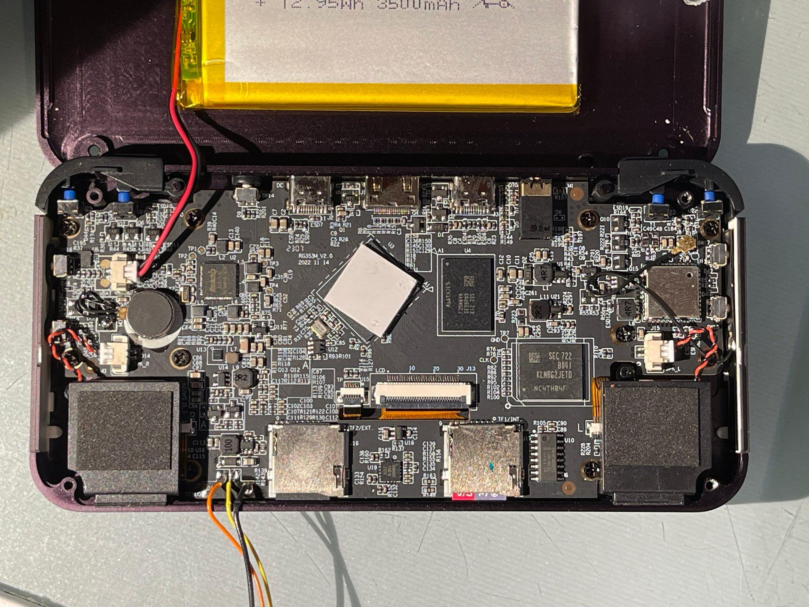
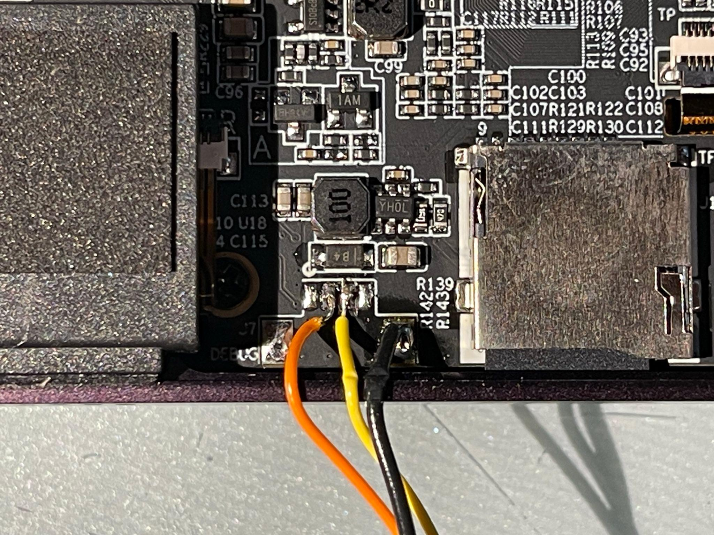

# UART

## RG353M 

Here's the open device with UART wires attached

Here's the closeup

Wires
- Orange: RX
- Yellow: TX
- Black: GND

No VCC (3.3V or 5V) connection is required.

Finding some way to secure the wires is recommended, since they will only take 4 or 5 flexes before they break.
